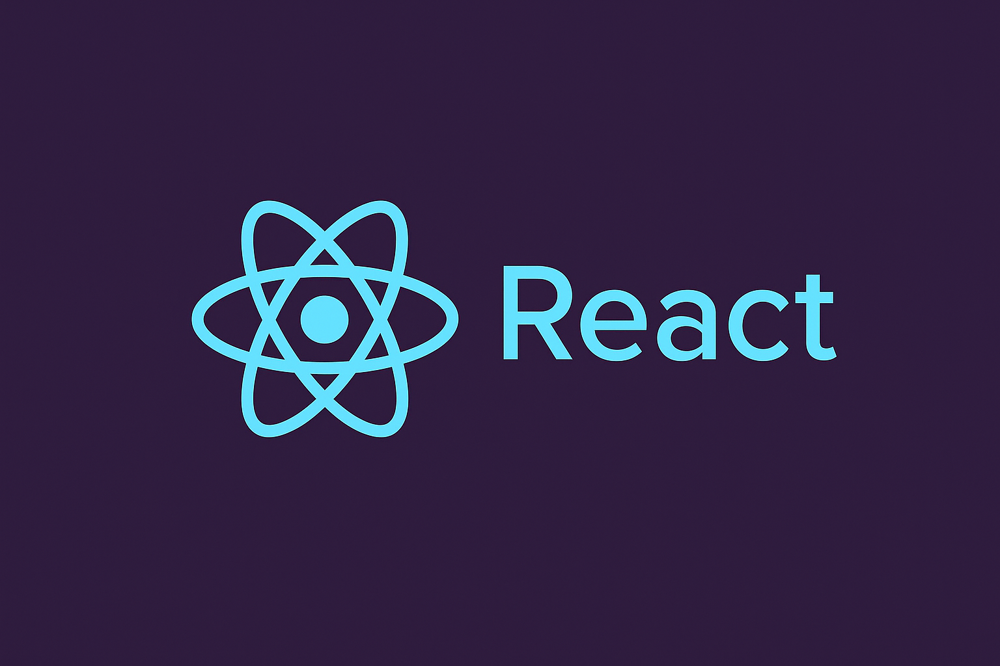

# 🚀 Sue Sewe — Personal Portfolio Website

Welcome to my personal portfolio website, built with **React.js** and hosted on **GitHub Pages**. This website showcases my skills, projects, and experience as a passionate **Junior Software Engineer** focused on creating impactful, web-based solutions for Africa and beyond.

🔗 **Live Website:** [sue2023.github.io/Portfolio](https://sue2023.github.io/Portfolio/)

---

## 🧑‍💻 About Me

I'm Susan Sewe, a junior software engineer and a graduate of the ALX Software Engineering program. I specialize in:

- Frontend development with **HTML5**, **CSS3**, **JavaScript**, and **React**
- Backend development using **Python** and **Flask**
- Building responsive, clean, and scalable web applications
- Solving real-world problems through technology

---

## ✨ Features of This Portfolio

- 🧭 **Navigation** — Smooth page navigation built with React Router
- 📱 **Responsive Design** — Optimized for desktop and mobile
- 🎨 **Styled Components** — Clean and modern UI with custom styles
- 🛠 **SEO Friendly** — Optimized structure for search indexing
- 🌐 **Hosted on GitHub Pages** — Fast and free deployment

---

## 📂 Project Structure

/
├── public/
├── src/
│ ├── components/
│ ├── pages/
│ └── App.js
├── .github/workflows/deploy.yml
└── package.json


---

## ⚙️ Tools & Technologies

- React.js
- React Router DOM
- HTML5 & CSS3
- JavaScript (ES6+)
- Git & GitHub
- GitHub Actions (CI/CD)
- GitHub Pages (Hosting)

---

## 🚀 How to Run Locally

1. Clone the repository:
   ```bash
   git clone https://github.com/SUE2023/Portfolio.git

2. Navigate into the project directory:
   ```bash
   cd Portfolio

3. Install dependencies:
   ```bash
   npm install

4. Start the development server:  
    ```bash
   npm start


🛠 Deployment
This project uses GitHub Actions to automatically deploy to the gh-pages branch every time changes are pushed to main.

📬 Contact
If you’d like to work together or get in touch:

📧 Email: susansewe@gmail.com

💼 LinkedIn: https://www.linkedin.com/in/sewe-susan/

🌐 Website: sue2023.github.io/Portfolio


⭐️ Support
If you like this project, feel free to star ⭐ this repository. It helps others discover it too!

📄 License
This project is licensed under the MIT License.
